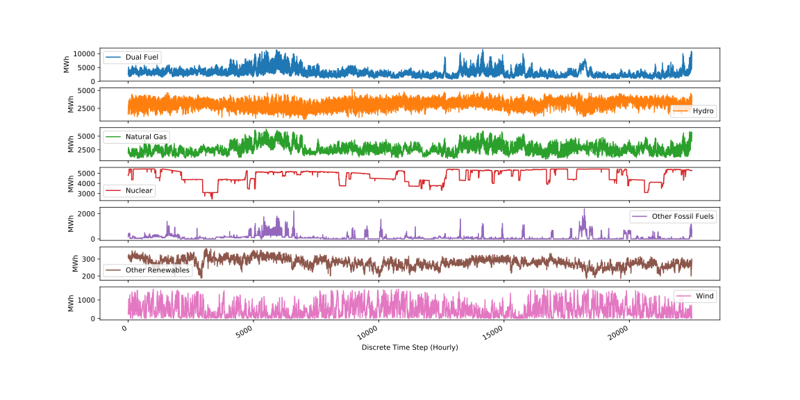

# Fuel Output Data

## Download

[scrape.ipynb](scrape.ipynb) pulls data by month from NYISO and stores the zip
files in [data](data).

## Sanitize

[sanitize.ipynb](sanitize.ipynb) sanitizes the [data](data) into a one-hot
matrix in [dataset.gz](dataset.gz). This data ultimately produces the curves
below.

