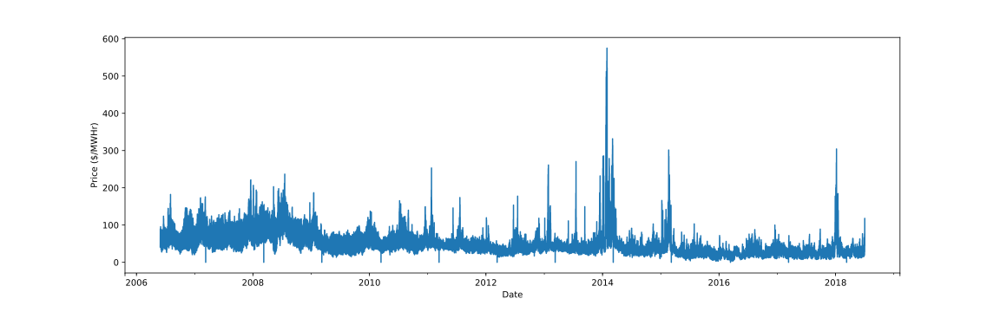

# Hourly Price Data

Hourly price data derives from
[here](https://www9.nationalgridus.com/niagaramohawk/business/rates/5_hour_charge.asp).

## Parameters for Form

| Parameter              | Selection                                          |
|:-----------------------|:---------------------------------------------------|
| Load Zone              | Central                                            |
| Service Class          | (SC-3 HP) Large General Service - Hourly Pricing   |
| Voltage Delivery Level | Primary                                            |
| From Date              | January 1, 2000                                    |
| To Date                | July 2, 2018                                       |
| Download               | Excel                                              |

This downloaded data is located in
[data/hourly-price-data.xls](data/hourly-price-data.xls).

## Sanitize

[sanitize.ipynb](sanitize.ipynb) sanitizes the data into a single time series
array in [dataset.gz](dataset.gz). It is worth noting that the database
only ranges from May 30, 2006, 01:00:00 to July 2, 2018, 23:00:00. It is also
worth noting that the data was fetched on July 2, 2018, 17:00:00, but has
records up to hour 23:00:00, indicating some level of predictive modeling
perhaps? This is worth investigating to ensure the data is raw and not the
result of some model somewhere. This data ultimately produces the curve below.

